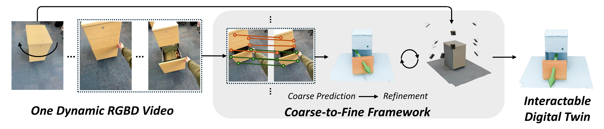

# Video2Articulation

:warning: *This repository is under active construction*

### Generalizable Articulated Object Reconstruction from Casually Captured RGBD Videos
[Weikun Peng](https://www.linkedin.com/in/weikun-peng-7731281b4/), [Jun Lv](https://lyuj1998.github.io/), [Cewu Lu](https://www.mvig.org/), [Manolis Savva](https://msavva.github.io/)



[Website](https://3dlg-hcvc.github.io/video2articulation/) | [arXiv](https://arxiv.org/abs/2506.08334) | [Data](https://huggingface.co/datasets/3dlg-hcvc/video2articulation)

## Environment Setup
Our code is tested on python=3.10. We recommend using conda to manage python environemnt.

1. Create a conda environment
   ```bash
   conda create -n video_articulation python=3.10
   conda activate video_articulation
   ```
2. Install `pytorch==2.4.0+cu124`. You can change the cuda version according to your hardware setup.
   ```bash
   pip install torch==2.4.0 torchvision==0.19.0 torchaudio==2.4.0 --index-url https://download.pytorch.org/whl/cu124
   ```
3. Install `pytorch3d`.
   ```bash
   pip install "git+https://github.com/facebookresearch/pytorch3d.git@stable"
   ```
4. Install other dependencies.
   ```python
   pip install opencv-python kornia open3d scipy Pillow trimesh yourdfpy wandb
   ```
5. We use `wandb` to log optimization statistics in the refinement process. Make sure you have a wandb account and export wandb API key to the environment
   ```bash
   export WANDB_API_KEY=YOUR_WANDB_API_KEY
   ```

## Prepare Dataset
Our synthetic dataset is public available on [huggingface](https://huggingface.co/datasets/3dlg-hcvc/video2articulation). Please follow the instructions to download the dataset. You also need to download [PartNet-Mobility Dataset](https://sapien.ucsd.edu/downloads) for geometry reconstruction evaluation. Please follow their term of use to download the dataset and place it in the project directory. The final project file structure should look like this:
```
project_root_directory
         |__docs
         |__partnet-mobility-v0
                     |__148
                     |__149
                     ......
         |__sim_data
               |__partnet_mobility
               |__exp_results
                        |__preprocessing
         |__real_data
               |__raw_data
               |__exp_results
                        |__preprocessing
         |__joint_coarse_prediction.py
         |__joint_refinement.py
         |__launch_joint_refinement.py
         |__new_partnet_mobility_dataset_correct_intr_meta.json
         |__partnet_mobility_data_split.yaml
         ......
```

## (Optional) Synthetic Data Generation
<details>
<summary> Click to expand</summary>

We also provide the template for generating synthetic dataset. Note that not all synthetic data in our dataset are generated with exactly the same script and same parameters.
```bash
python render_interaction_sim.py
```

</details>

## (Optional) Preprocessing
<details>
<summary>Click to expand</summary>

This step will compute the video moving map with [MonST3R](https://github.com/Junyi42/monst3r) and video part segmentation with [automatic part segmentation](https://github.com/willipwk/AutoSeg-SAM2). For real data, we also scale the depth map with [PromptDA](https://github.com/DepthAnything/PromptDA) and mask out hands from the interaction video with [Grounded-SAM-2](https://github.com/IDEA-Research/Grounded-SAM-2). It's a computational intensive work to process all the test videos in our synthetic dataset. Therefore, you can download the preprocessed data on [huggingface](https://huggingface.co/datasets/3dlg-hcvc/video2articulation) to skip this step. Otherwise, please continue.

1. Update submodules
   ```bash
   git submodule init
   git submodule update
   ```

2. Compute video moving map with [MonST3R](https://github.com/Junyi42/monst3r)
   Follow the instruction in `monst3r` to prepare the environment. Inside the `monst3r` directory, run
   ```bash
   python demo.py \
   --input ../sim_data/partnet_mobility/Microwave/7265/joint_0_bg/view_0/sample_rgb/ \
   --output_dir ../sim_data/exp_results/preprocessing/Microwave/7265/joint_0_bg/view_0/ \
   --seq_name monst3r \
   --motion_mask_thresh 0.35
   ```
   You can change the `motion_mask_thresh` number to see different video moving map segmentation results. In our paper, we use 0.35.

3. Compute video part segmentation with [automatic part segmentation](https://github.com/willipwk/AutoSeg-SAM2)

   Follow the instruction in `AutoSeg-SAM2` to prepare the environment. Inside the `AutoSeg-SAM2` directory, run
   ```bash
   python auto-mask-batch.py \
   --video_path ../sim_data/partnet_mobility/Microwave/7265/joint_0_bg/view_0/rgb_reverse \
   --output_dir ../sim_data/exp_results/preprocessing/Microwave/7265/joint_0_bg/view_0/video_segment_reverse \
   --batch_size 10 \
   --detect_stride 5 \
   --level small \
   --pred_iou_thresh 0.9 \
   --stability_score_thresh 0.95 \
   ```
   Results are saved inside `{--output_dir}`.
   You can also visualize the results for debug purpose.
   ```bash
   python visulization.py \
   --video_path ../sim_data/partnet_mobility/Microwave/7265/joint_0_bg/view_0/rgb_reverse \
   --output_dir ../sim_data/exp_results/preprocessing/Microwave/7265/joint_0_bg/view_0/
   --level small
   ```

4. **Real Data Only**. Scale up original depth maps with [PromptDA](https://github.com/DepthAnything/PromptDA). In our paper, we use iPhone 12 pro to capture real data. The original depth map is in 192 $\times$ 256, which is a very low resolution. Naively scale up the depth map via bilinear interpolation will produce noisy depth map. Therefore, we leverage PromptDA to scale up the depth map with relatively high quality. Inside the `PromptDA/` directory, run
   ```bash
   python scale_depth.py \
   --image_dir ../real_data/raw_data/book/surface/keyframes/corrected_images/ \
   --depth_dir ../real_data/raw_data/book/surface/keyframes/depth/ \
   --save_dir ../real_data/exp_results/preprocessing/book/prompt_depth_surface

   python scale_depth.py \
   --image_dir ../real_data/raw_data/book/rgb/ \
   -depth_dir ../real_data/raw_data/book/depth/ \
   --save_dir ../real_data/exp_results/preprocessing/book/prompt_depth_video
   ```
5. **Real Data Only**. Mask out hands and arms in theinteraction video with [Grounded-SAM-2](https://github.com/IDEA-Research/Grounded-SAM-2). In our paper, we discard hand information from the input video. Inside the `Grounded-SAM-2/` directory, run
   ```bash
   python mask_hand.py \
   --video_frame_dir ../real_data/raw_data/book/rgb/ \
   --save_dir ../real_data/exp_results/preprocessing/book/hand_mask/
   ```
6. **Real Data Only**. Align camera coordinates of the video to the coordinate for object surface reconstruction. Theoretically, we can add the initial frame of the video to the set of images for surface reconstruction. In that case, we can unify the coordinate for surface reconstruction and interaction video without extra effort. However, in our paper we use [Polycam](https://poly.cam/) for surface reconstruction and [Record3D](https://record3d.app/) to record interaction video. Therefore, we need to align them with a few more steps. Here we adopt a very simple strategy. Since we have both RGB images and depth maps for surface reconstruction and interaction video, we just compute feature matching between the first video frame and images used for surface reconstruction. We use the image pair with most reliable matches and compute SE3 transformation between them. This provides the transformation from camera poses in the interaction video to the surface reconstruction coordinate.
   ```bash
   python align_surface_video.py \
   --view_dir real_data/raw_data/book/ \
   --preprocess_dir real_data/exp_results/preprocessing/book/
   ```


</details>

## Coarse Prediction
Our pipeline starts with coarse prediction.
```bash
python joint_coarse_prediction.py \
--data_type sim \
--view_dir sim_data/partnet_mobility/Microwave/7265/joint_0_bg/view_0/ \
--preprocess_dir sim_data/exp_results/preprocessing/Microwave/7265/joint_0_bg/view_0/ \
--prediction_dir sim_data/exp_results/prediction/Microwave/7265/joint_0_bg/view_0/ \
--mask_type monst3r
```
Here the `view_dir` refers to the directory containing data of a specific test video. `preprocess_dir` refers to the directory containing preprocessed data by [MonST3R](https://github.com/Junyi42/monst3r) and [automatic part segmentation](https://github.com/zrporz/AutoSeg-SAM2). `prediction_dir` is the path you want to save the results. `mask_type` refers to the video moving map. You can run `python joint_coarse_prediction.py -h` to see different options.

After running the coarse prediction module, the results are saved inside `sim_data/exp_results/prediction/` folder.

## Refinement
The second stage is refinement. Our refinement module attempts to optimize joint parameters of a single type of joint. Therefore, you need to run this module twice to get final prediction results.
```bash
python launch_joint_refinement.py \
--data_type sim \
--exp_name refinement \
--view_dir sim_data/partnet_mobility/Microwave/7265/joint_0_bg/view_0/ \
--preprocess_dir sim_data/exp_results/preprocessing/Microwave/7265/joint_0_bg/view_0/ \
--prediction_dir sim_data/exp_results/prediction/Microwave/7265/joint_0_bg/view_0/ \
--mask_type monst3r \
--loss chamfer
```
Results are saved inside `sim_data/exp_results/prediction/` folder as well. You can add `--vis` option to visualize results in wandb panel during optimization. But please be aware that this visualization occpies a lot of storage.

## Mesh Reconstruction
We use [NKSR](https://github.com/nv-tlabs/NKSR) for mesh reconstruction. Please follow their instructions to prepare the environment. The pytorch and cuda versions to run NKSR are different from our method. Therefore, you probably need a new conda environment.

In the NKSR environment, run
```bash
python extract_mesh.py --data_type sim \
--view_dir sim_data/partnet_mobility/Microwave/7265/joint_0_bg/view_0/ \ 
--refinement_results_dir sim_data/exp_results/prediction/Microwave/7265/joint_0_bg/view_0/refinement/monst3r/chamfer/0/
```
It will reconstruct the whole mesh, the mesh of the moving part and static part of the object. It also samples 10000 points from the surface of the mesh for evaluating geometric reconstruction accuracy against the ground truth mesh. Results are saved inside `sim_data/exp_results/prediction/`. Note that sometimes this step needs large CUDA memory. We recommend using GPU with CUDA memory equal or larger than 48GB, such as RTX A6000.

## Evaluation
Finally, you can run `evaluate.py` to evaluate all the prediction results. This is only for synthetic data.
```bash
python evaluate.py \
--view_dir sim_data/partnet_mobility/Microwave/7265/joint_0_bg/view_0/ \ 
--refinement_results_dir sim_data/exp_results/prediction/Microwave/7265/joint_0_bg/view_0/refinement/monst3r/chamfer/0/
```

## Citation
If you find our work to be helpful, please consider cite our paper
```bibtex
@inproceedings{peng2025itaco,
 booktitle = {3DV 2026},
 author = {Weikun Peng and Jun Lv and Cewu Lu and Manolis Savva},
 title = {{iTACO: Interactable Digital Twins of Articulated Objects from Casually Captured RGBD Videos}},
 year = {2025}
}
```

## Acknowledgments
This work was funded in part by a Canada Research Chair, NSERC Discovery Grant, and enabled by support from the Digital Research Alliance of Canada. The authors would like to thank Jiayi Liu, Xingguang Yan, Austin T. Wang, Hou In Ivan Tam, Morteza Badali for valuable discussions, and Yi Shi for proofreading.