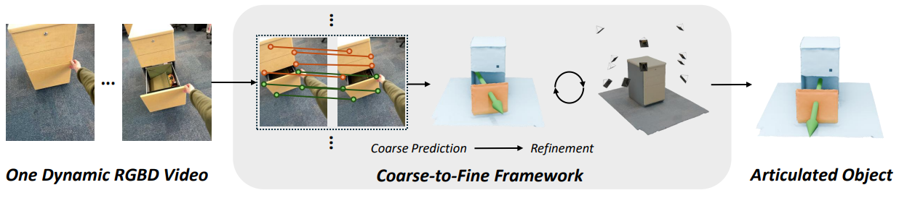

# Video2Articulation

:warning: *This repository is under active construction*

### Generalizable Articulated Object Reconstruction from Casually Captured RGBD Videos
[Weikun Peng](https://www.linkedin.com/in/weikun-peng-7731281b4/), [Jun Lv](https://lyuj1998.github.io/), [Cewu Lu](https://www.mvig.org/), [Manolis Savva](https://msavva.github.io/)



[Website](https://3dlg-hcvc.github.io/video2articulation/) | [arXiv](https://arxiv.org/abs/2506.08334) | [Data](https://huggingface.co/datasets/3dlg-hcvc/video2articulation)

## Environment Setup
Our code is tested on python=3.10. We recommend using conda to manage python environemnt.

1. Create a conda environment
   ```bash
   conda create -n video_articulation python=3.10
   conda activate video_articulation
   ```
2. Install `pytorch==2.4.0+cu124`. You can change the cuda version according to your hardware setup.
   ```bash
   pip install torch==2.4.0 torchvision==0.19.0 torchaudio==2.4.0 --index-url https://download.pytorch.org/whl/cu124
   ```
3. Install `pytorch3d`.
   ```bash
   pip install "git+https://github.com/facebookresearch/pytorch3d.git@stable"
   ```
4. Install other dependencies.
   ```python
   pip install opencv-python kornia open3d scipy Pillow trimesh yourdfpy wandb
   ```
5. We use `wandb` to log optimization statistics in the refinement process. Make sure you have a wandb account and export wandb API key to the environment
   ```bash
   export WANDB_API_KEY=YOUR_WANDB_API_KEY
   ```

## Prepare Dataset
Our synthetic dataset is public available on [huggingface](https://huggingface.co/datasets/3dlg-hcvc/video2articulation). Please follow the instructions to download the dataset. You also need to download [PartNet-Mobility Dataset](https://sapien.ucsd.edu/downloads) for geometry reconstruction evaluation. Please follow their term of use to download the dataset and place it in the project directory. The final project file structure should look like this:
```
project_root_directory
         |__docs
         |__partnet-mobility-v0
                     |__148
                     |__149
                     ......
         |__sim_data
               |__partnet_mobility
               |__exp_results
                        |__preprocessing
         |__joint_coarse_prediction.py
         |__joint_refinement.py
         |__launch_joint_refinement.py
         |__new_partnet_mobility_dataset_correct_intr_meta.json
         |__partnet_mobility_data_split.yaml
         ......
```

## Coarse Prediction
Our pipeline starts with coarse prediction.
```bash
python joint_coarse_prediction.py \
--view_dir sim_data/partnet_mobility/Microwave/7265/joint_0_bg/view_0/ \
--preprocess_dir sim_data/exp_results/preprocessing/Microwave/7265/joint_0_bg/view_0/ \
--prediction_dir sim_data/exp_results/prediction/Microwave/7265/joint_0_bg/view_0/ \
--mask_type monst3r
```
Here the `view_dir` refers to the directory containing data of a specific test video. `preprocess_dir` refers to the directory containing preprocessed data by [MonST3R](https://github.com/Junyi42/monst3r) and [automatic part segmentation](https://github.com/zrporz/AutoSeg-SAM2). `prediction_dir` is the path you want to save the results. `mask_type` refers to the video moving map. You can run `python joint_coarse_prediction.py -h` to see different options.

After running the coarse prediction module, the results are saved inside `sim_data/exp_results/prediction/` folder.

## Refinement
The second stage is refinement. Our refinement module attempts to optimize joint parameters of a single type of joint. Therefore, you need to run this module twice to get final prediction results.
```bash
python launch_joint_refinement.py --exp_name refinement \
--view_dir sim_data/partnet_mobility/Microwave/7265/joint_0_bg/view_0/ \
--preprocess_dir sim_data/exp_results/preprocessing/Microwave/7265/joint_0_bg/view_0/ \
--prediction_dir sim_data/exp_results/prediction/Microwave/7265/joint_0_bg/view_0/ \
--mask_type monst3r \
--loss chamfer
```
Results are saved inside `sim_data/exp_results/prediction/` folder as well. You can add `--vis` option to visualize results in wandb panel during optimization. But please be aware that this visualization occpies a lot of storage.

## Mesh Reconstruction
We use [NKSR](https://github.com/nv-tlabs/NKSR) for mesh reconstruction. Please follow their instructions to prepare the environment. The pytorch and cuda versions to run NKSR are different from our method. Therefore, you probably need a new conda environment.

In the NKSR environment, run
```bash
python extract_mesh.py \
--view_dir sim_data/partnet_mobility/Microwave/7265/joint_0_bg/view_0/ \ 
--refinement_results_dir sim_data/exp_results/prediction/Microwave/7265/joint_0_bg/view_0/refinement/monst3r/chamfer/0/
```
It will reconstruct the whole mesh, the mesh of the moving part and static part of the object. It also samples 10000 points from the surface of the mesh for evaluating geometric reconstruction accuracy against the ground truth mesh. Results are saved inside `sim_data/exp_results/prediction/`. Note that sometimes this step needs large CUDA memory. We recommend using GPU with CUDA memory equal or larger than 48GB, such as RTX A6000.

## Evaluation
Finally, you can run `evaluate.py` to evaluate all the prediction results. 
```bash
python evaluate.py \
--view_dir sim_data/partnet_mobility/Microwave/7265/joint_0_bg/view_0/ \ 
--refinement_results_dir sim_data/exp_results/prediction/Microwave/7265/joint_0_bg/view_0/refinement/monst3r/chamfer/0/
```

## Citation
If you find our work to be helpful, please consider cite our paper
```bibtex
@article{peng2025videoarticulation,
   Author = {Weikun Peng and Jun Lv and Cewu Lu and Manolis Savva},
   Title = {Generalizable Articulated Object Reconstruction from Casually Captured RGBD Videos},
   Year = {2025},
   Journal={arXiv preprint arXiv:2506.08334},
}
```

## Acknowledgments
This work was funded in part by a Canada Research Chair, NSERC Discovery Grant, and enabled by support from the Digital Research Alliance of Canada. The authors would like to thank Jiayi Liu, Xingguang Yan, Austin T. Wang, Hou In Ivan Tam, Morteza Badali for valuable discussions, and Yi Shi for proofreading.